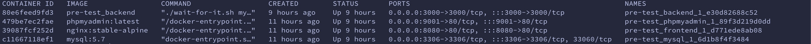
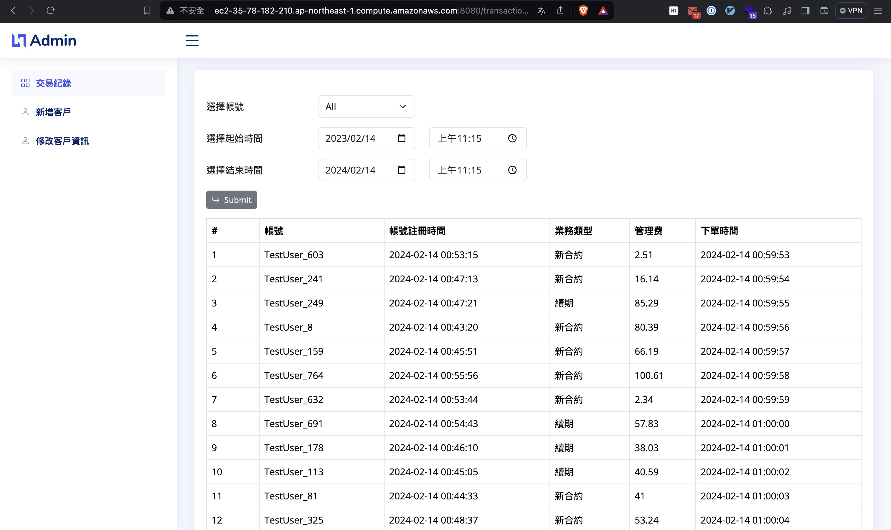
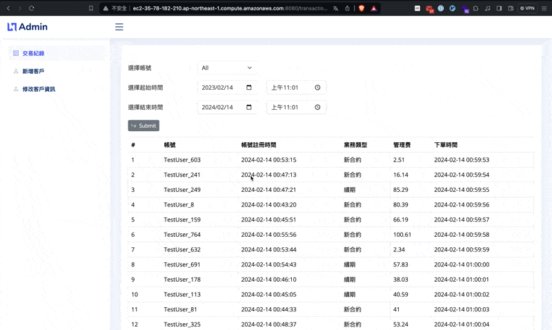
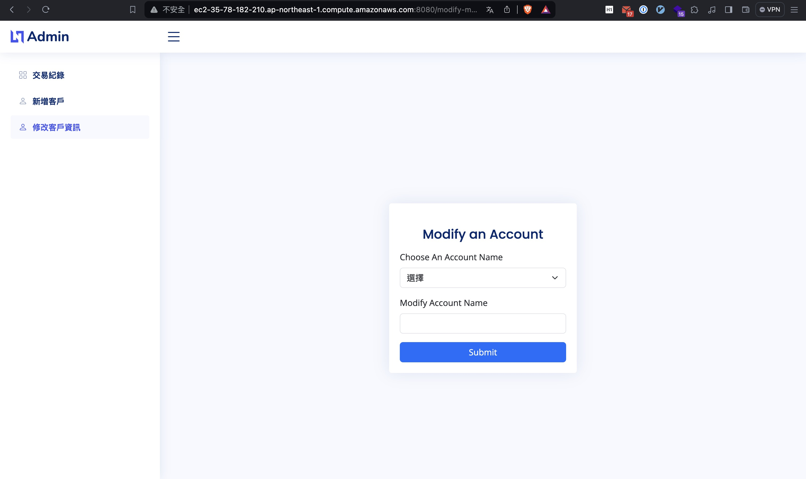
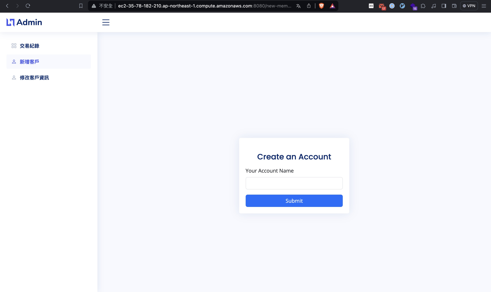
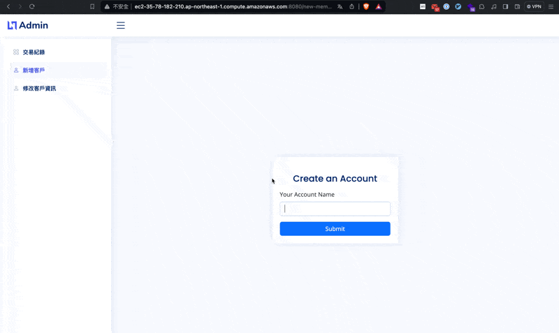

資料
-
- URL :
    - http://ec2-43-206-130-224.ap-northeast-1.compute.amazonaws.com:8080/
    - 請用chrome或者brave開啟
- data :
    - GitHub: https://github.com/cooper-car/contract_data
    - [database (schema+data)](<https://github.com/cooper-car/contract_data/tree/main/database>)
    - postman
    - docker-compose.yml
- frontend
    - tech stack : HTML, Vue(by cdn)
    - GitHub: https://github.com/cooper-car/contract_frontend
- backend
    - tech stack : Go, Gin, Gorm, MySQL
    - GitHub: https://github.com/cooper-car/contract_backend
- Infrastructure
    - tech stack : AWS EC2, Docker
- Note
    - 網站前後端分離
    - 網站容器化
    

EC2上容器化
- 

網站截圖
-

### ▸ 交易紀錄頁面

###  ▸ 修改客戶資訊頁面

### ▸ 新增客戶頁面

